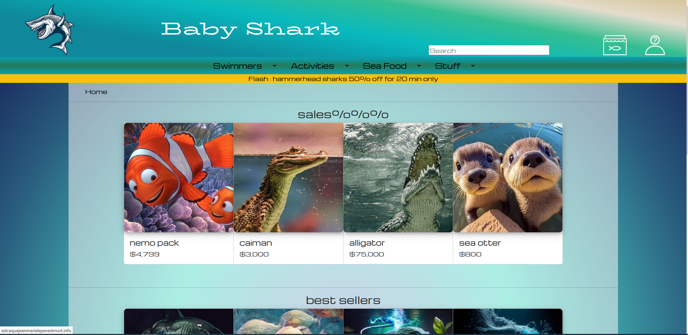
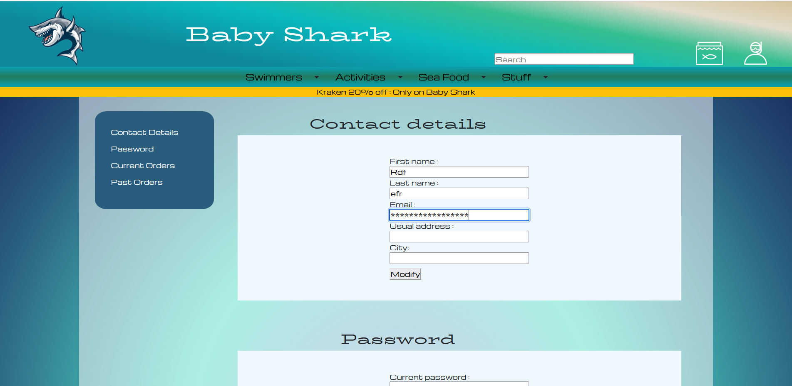

# Baby Shark

## Description

Baby Shark est une fausse marketplace réalisée par un groupe de cinq personnes dans le cadre de la Nurserie numérique, un stage de découverte des métiers du numérique de cinq semaines. Ce projet a été conçu pour prendre en main les outils et langages du web.

## Features

- Pages de produits (accessoires, nourriture, etc.)
- Panier d'achat
- Pages de compte utilisateur et d'inscription
- Simulation de connection

## Structure du Projet

  CSS/ : Contient les fichiers CSS pour le style des pages.
  JS/ : Contient les fichiers JavaScript (s'il y en a).
  img/ et imghomepage/ : Contiennent les images utilisées dans le projet.
  HTML Files : Les différentes pages HTML comme homepage.html, product1.html, cart.html, etc.

## Technologies Utilisées

  HTML
  CSS
  Bootstrap
  Javascript

## Catures d'écran 

    Ce projet a été réalisé dans le cadre de la Nurserie numérique.